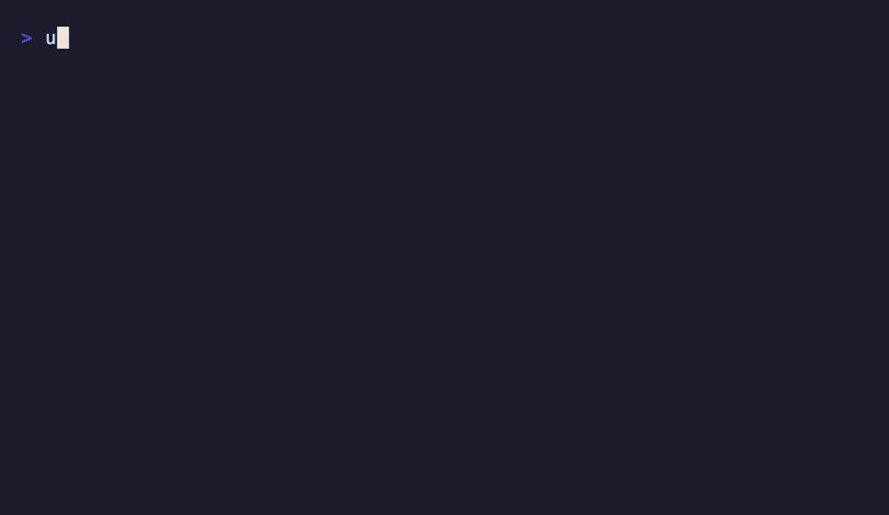

# peasy-css

[](https://www.npmjs.com/package/peasy-css)
[](https://www.typescriptlang.org/)
[](https://opensource.org/licenses/MIT)
[](https://www.npmjs.com/package/peasy-css)
[](https://github.com/peasytools/peasy-css-js)

Pure TypeScript CSS generator — gradients, shadows, flexbox, grid, animations, transforms, filters, glassmorphism, typography, clamp, and more. Zero dependencies, fully typed, ESM-only.

Built from [PeasyCSS](https://peasycss.com), the interactive CSS tools platform with 200+ generators and references.

> **Try the interactive tools at [peasycss.com](https://peasycss.com)** — gradient generator, box shadow, flexbox, grid, glassmorphism, and 200+ more CSS tools

<p align="center">
  
</p>

## Table of Contents

- [Install](#install)
- [Quick Start](#quick-start)
- [What You Can Do](#what-you-can-do)
  - [Gradients](#gradients)
  - [Box Shadows](#box-shadows)
  - [Flexbox Layouts](#flexbox-layouts)
  - [CSS Grid](#css-grid)
  - [Animations & Keyframes](#animations--keyframes)
  - [Transforms](#transforms)
  - [CSS Filters](#css-filters)
  - [Glassmorphism](#glassmorphism)
  - [Fluid Typography](#fluid-typography)
  - [Media Queries](#media-queries)
- [API Reference](#api-reference)
- [TypeScript Types](#typescript-types)
- [REST API Client](#rest-api-client)
- [Learn More](#learn-more)
- [Also Available](#also-available)
- [Peasy Developer Tools](#peasy-developer-tools)
- [License](#license)

## Install

```bash
npm install peasy-css
```

## Quick Start

```typescript
import {
  gradient,
  boxShadow,
  flexbox,
  glassmorphism,
} from "peasy-css";

// Generate a linear gradient
const bg = gradient(["#ff6b35", "#f7c948", "#2ec4b6"]);
// → "linear-gradient(to right, #ff6b35, #f7c948, #2ec4b6)"

// Create a box shadow with depth
const shadow = boxShadow({
  x: "0px",
  y: "4px",
  blur: "12px",
  color: "rgba(0,0,0,0.15)",
});
// → "0px 4px 12px 0px rgba(0,0,0,0.15)"

// Flexbox layout with centering
const layout = flexbox({ justify: "center", align: "center", gap: "1rem" });
// → "display: flex;\n  flex-direction: row;\n  ..."

// Frosted glass effect
const glass = glassmorphism({ blur: "20px" });
// → "backdrop-filter: blur(20px);\n  -webkit-backdrop-filter: ..."
```

## What You Can Do

### Gradients

CSS gradients create smooth color transitions — linear (directional), radial (circular), and conic (angular). All three types support repeating patterns and precise color stops.

| Type | CSS Function | Use Case |
|------|-------------|----------|
| Linear | `linear-gradient()` | Backgrounds, buttons, headers |
| Radial | `radial-gradient()` | Spotlight effects, circular highlights |
| Conic | `conic-gradient()` | Pie charts, color wheels |
| Repeating | `repeating-*-gradient()` | Striped patterns, progress bars |

```typescript
import { gradient, gradientCss } from "peasy-css";

// Linear gradient with custom direction
gradient(["#e66465", "#9198e5"], { direction: "to bottom" });
// → "linear-gradient(to bottom, #e66465, #9198e5)"

// Radial gradient for spotlight effect
gradient(["#fff", "#000"], { gradientType: "radial" });
// → "radial-gradient(circle, #fff, #000)"

// Color stops with precise positions
gradient([
  { color: "red", position: "0%" },
  { color: "yellow", position: "50%" },
  { color: "green", position: "100%" },
]);

// Complete CSS rule for a hero section
gradientCss(".hero", ["#667eea", "#764ba2"]);
// → ".hero {\n  background: linear-gradient(to right, #667eea, #764ba2);\n}"
```

Learn more: [CSS Gradient Generator](https://peasycss.com/css/css-gradient/) · [CSS Gradients Guide](https://peasycss.com/guides/css-gradients-guide/) · [Gradient Design Trends & Techniques](https://peasycss.com/guides/gradient-design-trends-techniques/)

### Box Shadows

Box shadows add depth and elevation to elements. Multiple shadows create complex effects like material design elevation or neumorphism.

```typescript
import { boxShadow, boxShadowCss } from "peasy-css";

// Single shadow with elevation
boxShadow({ x: "0px", y: "4px", blur: "6px", color: "rgba(0,0,0,0.1)" });

// Inset shadow for pressed/recessed look
boxShadow({ inset: true, y: "2px", blur: "4px", color: "rgba(0,0,0,0.2)" });

// Layered shadows for realistic depth
boxShadow(
  { y: "2px", blur: "4px", color: "rgba(0,0,0,0.1)" },
  { y: "8px", blur: "16px", color: "rgba(0,0,0,0.1)" },
);
```

Learn more: [CSS Box Shadow Generator](https://peasycss.com/css/css-shadow/) · [What is Box Model?](https://peasycss.com/glossary/box-model/) · [What is Stacking Context?](https://peasycss.com/glossary/stacking-context/)

### Flexbox Layouts

Flexbox distributes space and aligns items in one dimension — row or column.

```typescript
import { flexbox, flexboxCss } from "peasy-css";

// Centered content
flexbox({ justify: "center", align: "center" });

// Responsive card layout with wrapping
flexbox({ wrap: "wrap", gap: "1.5rem", justify: "space-between" });

// Complete navbar rule
flexboxCss(".navbar", { direction: "row", justify: "space-between", align: "center" });
```

Learn more: [CSS Flexbox Generator](https://peasycss.com/css/css-flexbox/) · [Flexbox vs CSS Grid](https://peasycss.com/guides/flexbox-vs-css-grid/) · [What is Flexbox?](https://peasycss.com/glossary/flexbox/)

### CSS Grid

Two-dimensional layout for rows and columns simultaneously.

```typescript
import { grid, gridCss } from "peasy-css";

// Default 3-column grid
grid();

// Responsive auto-fill grid with dense packing
grid({ columns: "repeat(auto-fill, minmax(250px, 1fr))", autoFlow: "dense" });

// Dashboard layout
gridCss(".dashboard", { columns: "250px 1fr 1fr", rows: "auto 1fr auto", gap: "2rem" });
```

Learn more: [CSS Grid Generator](https://peasycss.com/css/css-grid/) · [CSS Grid vs Flexbox: When to Use Each](https://peasycss.com/guides/css-grid-vs-flexbox-when-to-use-each/) · [What is CSS Grid?](https://peasycss.com/glossary/grid/)

### Animations & Keyframes

Multi-step CSS animations with shorthand generation and `@keyframes` rules.

```typescript
import { animation, keyframes, animationCss } from "peasy-css";

// Animation shorthand
animation("fadeIn", { duration: "0.5s", timing: "ease-in" });
// → "fadeIn 0.5s ease-in 0s 1 normal none"

// Keyframes definition
keyframes("fadeIn", [
  { selector: "from", properties: { opacity: "0", transform: "translateY(-20px)" } },
  { selector: "to", properties: { opacity: "1", transform: "translateY(0)" } },
]);
```

Learn more: [CSS Animation Generator](https://peasycss.com/css/css-animation/) · [How to Create CSS Animations](https://peasycss.com/guides/how-to-create-css-animations/) · [What is Keyframe Animation?](https://peasycss.com/glossary/keyframe-animation/)

### Transforms

Translate, rotate, scale, and skew elements without affecting document flow.

```typescript
import { transform, transformCss } from "peasy-css";

transform({ rotate: "45deg" });
// → "rotate(45deg)"

transform({ translateX: "10px", translateY: "20px", rotate: "45deg", scaleX: "1.5" });
// → "translate(10px, 20px) rotate(45deg) scale(1.5, 1)"
```

Learn more: [CSS Transform Generator](https://peasycss.com/css/css-transform/) · [CSS Animation Performance Guide](https://peasycss.com/guides/css-animation-performance-guide/) · [What is Transition?](https://peasycss.com/glossary/transition/)

### CSS Filters

Graphical effects — blur, brightness, contrast, grayscale — for images and hover states.

```typescript
import { cssFilter, filterCss } from "peasy-css";

cssFilter({ blur: "5px" });
// → "blur(5px)"

cssFilter({ blur: "2px", brightness: "120%", grayscale: "50%" });
// → "blur(2px) brightness(120%) grayscale(50%)"
```

Learn more: [CSS Filter Effects Generator](https://peasycss.com/css/css-filter-effects/) · [CSS Clip Path Generator](https://peasycss.com/css/css-clip-path/) · [What is Color Function?](https://peasycss.com/glossary/color-function/)

### Glassmorphism

Frosted glass effect with backdrop-filter, semi-transparent backgrounds, and subtle borders.

```typescript
import { glassmorphism, glassmorphismCss } from "peasy-css";

glassmorphism();
// → "backdrop-filter: blur(10px);\n  -webkit-backdrop-filter: ..."

glassmorphismCss(".modal", { blur: "15px", background: "rgba(0,0,0,0.3)" });
```

Learn more: [Dark Mode Design Best Practices](https://peasycss.com/guides/dark-mode-design-best-practices/) · [What is Custom Property?](https://peasycss.com/glossary/custom-property/) · [What is Cascade?](https://peasycss.com/glossary/cascade/)

### Fluid Typography

CSS `clamp()` for smooth scaling between viewport sizes.

```typescript
import { clamp, clampFontCss } from "peasy-css";

clamp("1rem", "2.5vw", "3rem");
// → "clamp(1rem, 2.5vw, 3rem)"

clampFontCss("h1", "1.5rem", "4vw", "3rem");
// → "h1 {\n  font-size: clamp(1.5rem, 4vw, 3rem);\n}"
```

Learn more: [Fluid Typography with Clamp in Modern CSS](https://peasycss.com/guides/fluid-typography-clamp-modern-css/) · [What is Clamp?](https://peasycss.com/glossary/clamp/) · [What is Viewport Unit?](https://peasycss.com/glossary/viewport-unit/)

### Media Queries

Responsive design with viewport breakpoints.

```typescript
import { mediaQuery } from "peasy-css";

// Mobile-first (min-width)
mediaQuery("768px", ".sidebar { display: block; }");

// Desktop-first (max-width)
mediaQuery("480px", "body { font-size: 14px; }", "max-width");
```

Learn more: [CSS Media Query Generator](https://peasycss.com/css/css-media-query-generator/) · [Responsive Layouts Without Media Queries](https://peasycss.com/guides/responsive-layouts-without-media-queries/) · [What is Media Query?](https://peasycss.com/glossary/media-query/)

## API Reference

| Function | Description |
|----------|-------------|
| `gradient(colors, options?)` | CSS gradient value |
| `gradientCss(selector, colors, options?)` | Complete gradient CSS rule |
| `boxShadow(...shadows)` | box-shadow value |
| `boxShadowCss(selector, ...shadows)` | Complete box-shadow CSS rule |
| `textShadow(x?, y?, blur?, color?)` | text-shadow value |
| `textShadowCss(selector, x?, y?, blur?, color?)` | Complete text-shadow CSS rule |
| `borderRadius(tl?, tr?, br?, bl?)` | border-radius value |
| `borderRadiusCss(selector, tl?, tr?, br?, bl?)` | Complete border-radius CSS rule |
| `flexbox(options?)` | Flexbox properties |
| `flexboxCss(selector, options?)` | Complete flexbox CSS rule |
| `grid(template?)` | Grid properties |
| `gridCss(selector, template?)` | Complete grid CSS rule |
| `animation(name, options?)` | animation shorthand value |
| `animationCss(selector, name, options?)` | Complete animation CSS rule |
| `keyframes(name, frames)` | @keyframes rule |
| `transform(options?)` | transform value |
| `transformCss(selector, options?)` | Complete transform CSS rule |
| `cssFilter(options?)` | filter value |
| `filterCss(selector, options?)` | Complete filter CSS rule |
| `transition(property?, options?)` | transition value |
| `transitionCss(selector, property?, options?)` | Complete transition CSS rule |
| `mediaQuery(breakpoint, css, type?)` | @media rule |
| `typography(options?)` | Typography properties |
| `typographyCss(selector, options?)` | Complete typography CSS rule |
| `aspectRatio(ratio)` | aspect-ratio value |
| `aspectRatioCss(selector, ratio)` | Complete aspect-ratio CSS rule |
| `clamp(min, preferred, max)` | clamp() value |
| `clampFontCss(selector, min, preferred, max)` | Complete fluid font-size CSS rule |
| `glassmorphism(options?)` | Glassmorphism properties |
| `glassmorphismCss(selector, options?)` | Complete glassmorphism CSS rule |

## TypeScript Types

```typescript
import type {
  ColorStop,
  Shadow,
  GridTemplate,
  Keyframe,
  GradientOptions,
  FlexboxOptions,
  AnimationOptions,
  TransformOptions,
  FilterOptions,
  TransitionOptions,
  TypographyOptions,
  GlassmorphismOptions,
  GradientDirection,
  GradientType,
  FlexDirection,
  FlexWrap,
  FlexJustify,
  FlexAlign,
  GridAutoFlow,
  TimingFunction,
  FontWeight,
} from "peasy-css";
```

## REST API Client

The API client connects to the [PeasyCSS developer API](https://peasycss.com/developers/) for tool discovery and content.

```typescript
import { PeasyCssClient } from "peasy-css";

const client = new PeasyCssClient();

// List available tools
const tools = await client.listTools();
console.log(tools.results);

// Search across all content
const results = await client.search("minify");
console.log(results);

// Browse the glossary
const glossary = await client.listGlossary({ search: "format" });
for (const term of glossary.results) {
  console.log(`${term.term}: ${term.definition}`);
}

// Discover guides
const guides = await client.listGuides({ category: "css" });
for (const guide of guides.results) {
  console.log(`${guide.title} (${guide.audience_level})`);
}
```

Full API documentation at [peasycss.com/developers/](https://peasycss.com/developers/).

## Learn More

- **Tools**: [CSS Minify](https://peasycss.com/css/css-minify/) · [CSS Beautify](https://peasycss.com/css/css-beautify/) · [CSS Gradient Generator](https://peasycss.com/css/css-gradient/) · [Box Shadow Generator](https://peasycss.com/css/css-shadow/) · [Flexbox Generator](https://peasycss.com/css/css-flexbox/) · [Grid Generator](https://peasycss.com/css/css-grid/) · [Animation Generator](https://peasycss.com/css/css-animation/) · [Transform Generator](https://peasycss.com/css/css-transform/) · [Filter Effects](https://peasycss.com/css/css-filter-effects/) · [Media Query Generator](https://peasycss.com/css/css-media-query-generator/) · [Border Radius](https://peasycss.com/css/css-border-radius/) · [Text Shadow](https://peasycss.com/css/css-text-shadow/) · [Clip Path](https://peasycss.com/css/css-clip-path/) · [Unit Converter](https://peasycss.com/css/css-unit-converter/) · [Color Converter](https://peasycss.com/css/css-color-converter/) · [All CSS Tools](https://peasycss.com/)
- **Guides**: [CSS Units Explained](https://peasycss.com/guides/css-units-explained/) · [CSS Grid vs Flexbox](https://peasycss.com/guides/css-grid-vs-flexbox-when-to-use-each/) · [CSS Custom Properties Guide](https://peasycss.com/guides/css-custom-properties-variables-complete-guide/) · [CSS Animation Performance](https://peasycss.com/guides/css-animation-performance-browser-guide/) · [CSS Gradients Guide](https://peasycss.com/guides/css-gradients-guide/) · [Flexbox vs CSS Grid](https://peasycss.com/guides/flexbox-vs-css-grid/) · [Dark Mode Best Practices](https://peasycss.com/guides/dark-mode-design-best-practices/) · [How to Create CSS Animations](https://peasycss.com/guides/how-to-create-css-animations/) · [Responsive Layouts Without Media Queries](https://peasycss.com/guides/responsive-layouts-without-media-queries/) · [Troubleshooting CSS Specificity](https://peasycss.com/guides/troubleshooting-css-specificity/) · [Fluid Typography with Clamp](https://peasycss.com/guides/fluid-typography-clamp-modern-css/) · [How to Minify CSS for Production](https://peasycss.com/guides/how-to-minify-css-production/) · [All Guides](https://peasycss.com/guides/)
- **Glossary**: [Flexbox](https://peasycss.com/glossary/flexbox/) · [CSS Grid](https://peasycss.com/glossary/grid/) · [Box Model](https://peasycss.com/glossary/box-model/) · [Cascade](https://peasycss.com/glossary/cascade/) · [Specificity](https://peasycss.com/glossary/specificity/) · [Custom Property](https://peasycss.com/glossary/custom-property/) · [Media Query](https://peasycss.com/glossary/media-query/) · [Keyframe Animation](https://peasycss.com/glossary/keyframe-animation/) · [Clamp](https://peasycss.com/glossary/clamp/) · [BEM](https://peasycss.com/glossary/bem/) · [Z-Index](https://peasycss.com/glossary/z-index/) · [Transition](https://peasycss.com/glossary/transition/) · [Viewport Unit](https://peasycss.com/glossary/viewport-unit/) · [Pseudo Class](https://peasycss.com/glossary/pseudo-class/) · [All Terms](https://peasycss.com/glossary/)
- **Formats**: [CSS](https://peasycss.com/formats/css/) · [SVG](https://peasycss.com/formats/svg/) · [HTML](https://peasycss.com/formats/html/) · [SCSS](https://peasycss.com/formats/scss/) · [LESS](https://peasycss.com/formats/less/) · [All Formats](https://peasycss.com/formats/)
- **API**: [REST API Docs](https://peasycss.com/developers/) · [OpenAPI Spec](https://peasycss.com/api/openapi.json)

## Also Available

| Language | Package | Install |
|----------|---------|---------|
| **Python** | [peasy-css](https://pypi.org/project/peasy-css/) | `pip install "peasy-css[all]"` |
| **Go** | [peasy-css-go](https://pkg.go.dev/github.com/peasytools/peasy-css-go) | `go get github.com/peasytools/peasy-css-go` |
| **Rust** | [peasy-css](https://crates.io/crates/peasy-css) | `cargo add peasy-css` |
| **Ruby** | [peasy-css](https://rubygems.org/gems/peasy-css) | `gem install peasy-css` |

## Peasy Developer Tools

Part of the [Peasy Tools](https://peasytools.com) open-source developer ecosystem.

| Package | PyPI | npm | Description |
|---------|------|-----|-------------|
| peasy-pdf | [PyPI](https://pypi.org/project/peasy-pdf/) | [npm](https://www.npmjs.com/package/peasy-pdf) | PDF merge, split, rotate, compress, 21 operations — [peasypdf.com](https://peasypdf.com) |
| peasy-image | [PyPI](https://pypi.org/project/peasy-image/) | [npm](https://www.npmjs.com/package/peasy-image) | Image resize, crop, convert, compress — [peasyimage.com](https://peasyimage.com) |
| peasy-audio | [PyPI](https://pypi.org/project/peasy-audio/) | [npm](https://www.npmjs.com/package/peasy-audio) | Audio trim, merge, convert, normalize — [peasyaudio.com](https://peasyaudio.com) |
| peasy-video | [PyPI](https://pypi.org/project/peasy-video/) | [npm](https://www.npmjs.com/package/peasy-video) | Video trim, resize, thumbnails, GIF — [peasyvideo.com](https://peasyvideo.com) |
| **peasy-css** | **[PyPI](https://pypi.org/project/peasy-css/)** | **[npm](https://www.npmjs.com/package/peasy-css)** | **CSS minify, format, analyze — [peasycss.com](https://peasycss.com)** |
| peasy-compress | [PyPI](https://pypi.org/project/peasy-compress/) | [npm](https://www.npmjs.com/package/peasy-compress) | ZIP, TAR, gzip compression — [peasytools.com](https://peasytools.com) |
| peasy-document | [PyPI](https://pypi.org/project/peasy-document/) | [npm](https://www.npmjs.com/package/peasy-document) | Markdown, HTML, CSV, JSON conversion — [peasyformats.com](https://peasyformats.com) |
| peasytext | [PyPI](https://pypi.org/project/peasytext/) | [npm](https://www.npmjs.com/package/peasytext) | Text case conversion, slugify, word count — [peasytext.com](https://peasytext.com) |

## License

MIT
